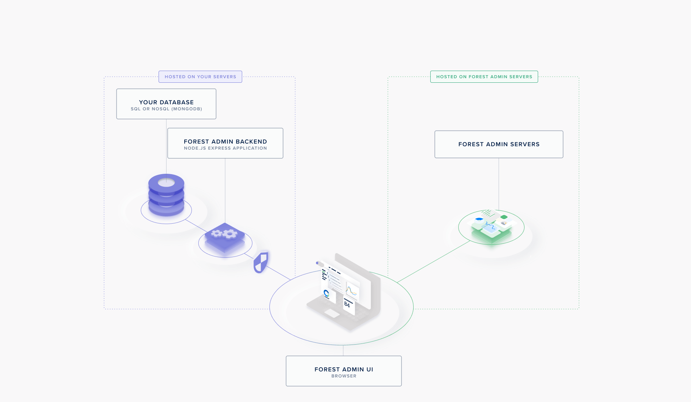

# How it works

Before you start writing a single line of code, it’s a good idea to get an overview of how Forest Admin works. The magic lies in its architecture.

Forest Admin provides you with:

- An API hosted on your server to retrieve your data. We call it the **Admin Backend**. It can be a **standalone project** or an existing app as a datasource (Laravel, Symfony), your Admin Backend will be generated **within your app**.
- A user interface to access and manage your data from your browser. This **Forest Admin User Interface** is built and managed through ressources hosted on Forest Admin's servers.

TODO NEED THE CORRECT IMAGE FOR PHP (RAILS EXAMPLE HERE https://docs.forestadmin.com/documentation/reference-guide/how-it-works)

## The agent

The Admin Backend is generated upon install and **hosted on your end**.

It includes an API allowing to **translate calls made from the Forest Admin UI into queries** to your database (covering actions such as CRUD, search & filters, pagination, sorting, etc.).

It also provides the Forest Admin servers with the information needed to build the User Interface (the **Forest Admin Schema**). This information includes table names, column names and types, and relationships. It is sent when you run your agent within a file called `forestadmin-schema.json`.
